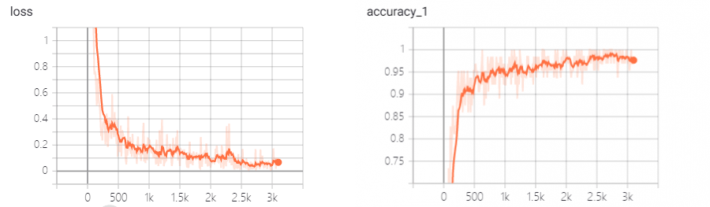

# 基于深度学习的文本分类

使用TextCNN和TextRNN网络进行中文文本分类

## 环境

- Python 3.7
- TensorFlow 1.5
- numpy      1.16
- scikit-learn  0.19.2
- scipy     1.1.0

## 运行
| 类别 | 模型 | 训练与测试 | 运行|
|:----:|:----:|:------:|:-----:|
|TextCNN|cnn_model.py|run_cnn.py|python run_cnn.py|
|TextRNN|rnn_model.py|run_rnn.py|python run_rnn.py|

## 数据集

使用[THUCNews](http://thuctc.thunlp.org/)的一个子集进行训练与测试

子集链接: https://pan.baidu.com/s/1hugrfRu 密码: qfud<br />
**下载所有文件，放到cnews目录下即可**

数据集划分如下：

|文件|功能|维度|
|:--:|:--:|:---:|
|data/cnews.train.txt|训练集|(5000*10,?)|
|data/cnews.test.txt|测试集|(1000*10,?)|
|data/cnews.val.txt|验证集|(500*10,?)|
|data/cnews.vocab.txt|词汇表|(5000,1)|

## 数据预处理

1. 读取文件数据，将其划分为文本和标签两部分
2. 将字符级的词汇表转换为`{词：id}`表示
3. 将分类目录转换为`{类别：id}`表示
4. 将数据文本和标签根据前两部转换为固定长度的id序列表示，其中将标签序列转换为one-hot形式
   
## TextCNN网络

### 配置参数

```python
class TCNNConfig(object):
    """CNN配置参数"""

    embedding_dim = 64      # 词向量维度
    seq_length = 600        # 序列长度
    num_classes = 10        # 类别数
    num_filters = 128        # 卷积核数目
    kernel_size = 5         # 卷积核尺寸
    vocab_size = 5000       # 词汇表达小

    hidden_dim = 128        # 全连接层神经元

    dropout_keep_prob = 0.5 # dropout保留比例
    learning_rate = 1e-3    # 学习率

    batch_size = 64         # 每批训练大小
    num_epochs = 10         # 总迭代轮次

    print_per_batch = 100    # 每多少轮输出一次结果
    save_per_batch = 10      # 每多少轮存入tensorboard
```

### 模型

自训练词嵌入矩阵+单层TextCNN网络

|文件|功能|
|:--:|:--:|
|cnews_loader.py|数据预处理|
|cnn_model.py|网络模型|
|run_cnn.py|训练+测试|

### 评价指标
训练：

* loss: softmax交叉熵损失函数
* 准确率，误差
  

模型：

* 查准率，查全率，F1度量
  
